# ✨ Gym Log App

This mobile application is the final project for [Full Stack Open](https://fullstackopen.com/en/) course.
The application allows users to log workouts and track/display data of their progress in the gym.
Created and tested on iOS.

_Live demo https://expo.dev/@villepr/gym-log_

## Menu

- [🔧 Technologies & Tools](#-technologies--tools-)
- [🚀 Features](#-features-)
- [📷 Demo & Screenshots](#-demo--screenshots-)
- [⌚ Working hours](#-working-hours-)
- [👤 Author](#-author-)

## 🔧 Technologies & Tools [🔝](#-gym-log-app)

  
  
  
  
  
  
  

## 🚀 Features [🔝](#-gym-log-app)

- Log improvised or planned workouts
- Create account with some initialized exercises, planned workouts and routines
- Create your own routines, planned workouts and exercises
- Complete achievements and earn medals
  - 5 tiers
- Home screen widgets
  - Overall statistics
  - Followed routine
  - Favoutite exercises
  - Favourite graphs
  - Favourite achievements
- Statistics and graphs
  - Overall
  - Target muscles
  - Exercises
  - Data grouping and interval
- History
  - Completed workouts
  - Completed sets
- Calculators
  - 1 rep max
  - Warmup
- Settings
  - Home widgets editing
  - Graph style and data editing

## 📷 Demo & Screenshots [🔝](#-gym-log-app)

  
  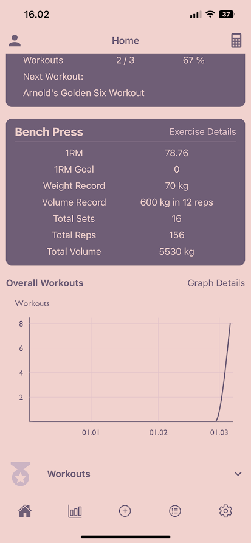
  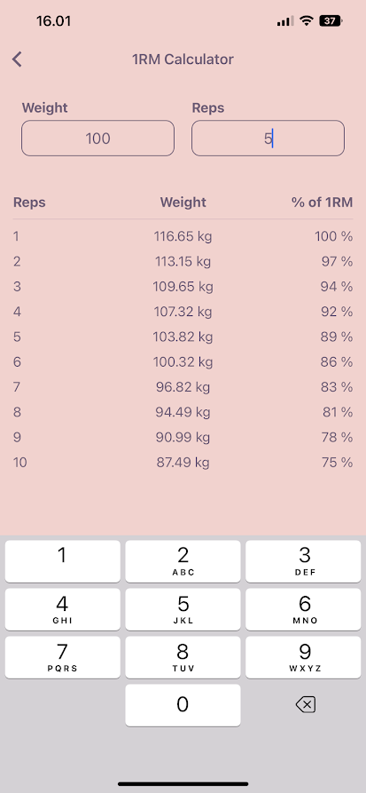
  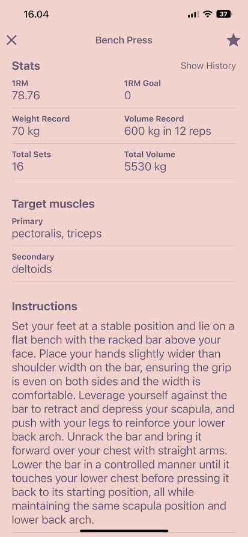
  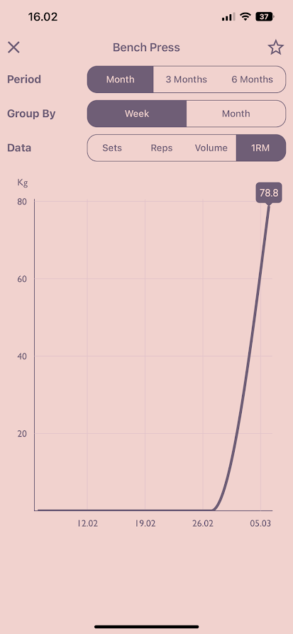
  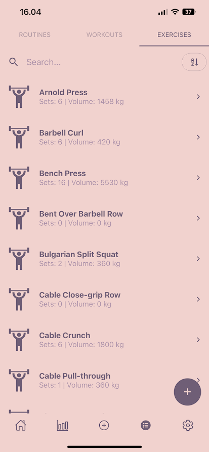
  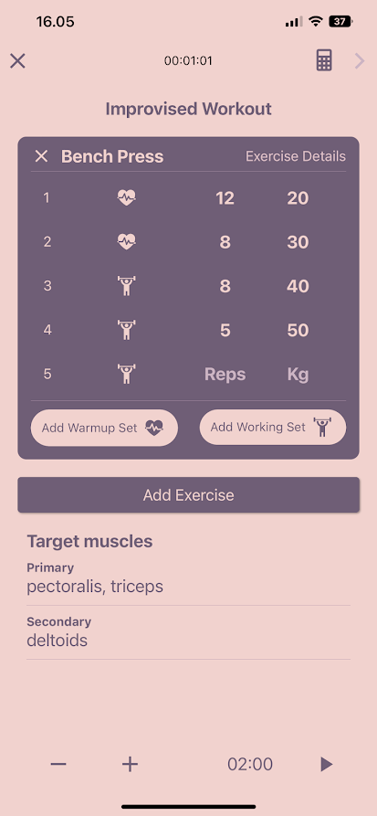
  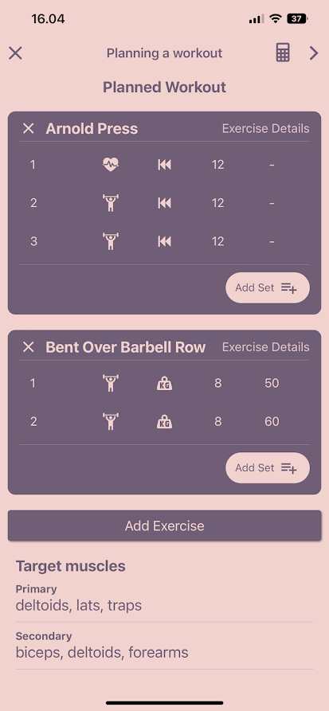
  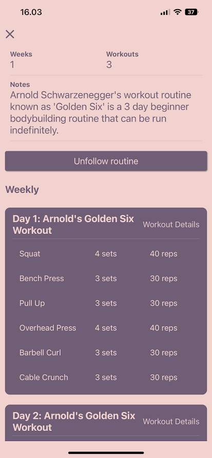
  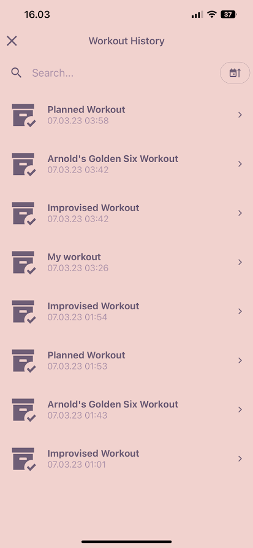
  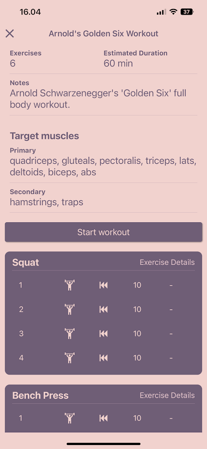
  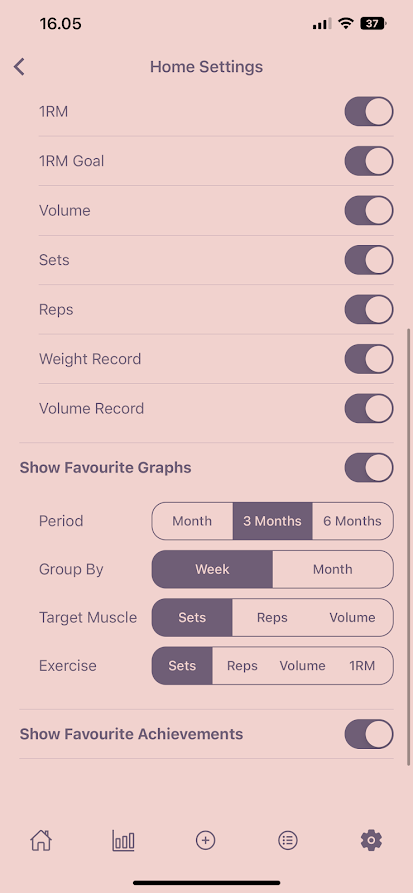

## ⌚ Working hours [🔝](#-gym-log-app)

|   date   | hours | what I did |
|   :--:   | :---: | :--------: |
| 21.01.23 | 3     | initiated project and experimented with different exercise apis |
| 24.01.23 | 3     | navigation bar with bootstrap and react router |
| 24.01.23 | 1     | more routes |
| 25.01.23 | 1     | IMPORTANT! Decided to go with a mobile app due to the nature of the app. Configured react native app |
| 26.01.23 | 5     | Learned about the usage of React navigation and added bottom tabs navigation with multiple pages |
| 28.01.23 | 6     | Added exercise list with search bar and individual exercise views with details of exercise |
| 28.01.23 | 2     | Added logger modal with blur background, icons for tab navigation |
| 01.02.23 | 3     | Worked on workout view |
| 02.02.23 | 6     | Worked on logger, added stopwatch and support to add exercises and sets to exercises |
| 03.02.23 | 3     | Worked on logger, fixed stopwatch, added support to add warmup/working sets, support to log planned workout |
| 03.02.23 | 5     | Worked on backend, sets, exercises, workouts, planned sets, planned workouts |
| 04.02.23 | 5     | Worked on backend, restructuring logger to fit backend, started integrating frontend with backend |
| 06.02.23 | 4     | Restructuring for more universal components, can now log a full improvised workout |
| 07.02.23 | 4     | Started working on creation of a planned workout |
| 07.02.23 | 2     | Worked on creation of a planned set for a planned workout |
| 08.02.23 | 4     | Can now create a planned workout |
| 09.02.23 | 4     | Can now log a planned workout |
| 09.02.23 | 3     | Started integrating redux for app (Should have done this in the beginning :'))|
| 10.02.23 | 4     | Redux for workouts, exercisePicker, cant pick exercise more than once, reworked logger/backend to minimize backend requests (create many sets) |
| 10.02.23 | 3     | Completed redux integration and optimized calls to backend for workout planner |
| 10.02.23 | 2     | backend fixes, automatic 1RM updating, weight populating for planned sets, updateExercise  |
| 10.02.23 | 3     | some cleanup, workout history + workout details, cascading deletion of completed workout + sets in workout with alert, simple add exercise |
| 10.02.23 | 1     | some styling for exercises view |
| 11.02.23 | 6     | learned about theming and tested some themes, learned about React Native Elements and styled exercise list, add exercise expanded, changed model of exercise |
| 15.02.23 | 3     | changes to removal methods in backend, middleware to handle cascading removal for workout, custom hook for initializing state |
| 15.02.23 | 2     | middleware to handle cascading removal for exercise, |
| 15.02.23 | 1     | can now create, edit and delete exercises |
| 15.02.23 | 1     | fixed broken 1rm updating |
| 16.02.23 | 3     | styled planned workout list to match exercise list, can now delete planned workouts, backend middleware for cascading deletion of planned workouts |
| 16.02.23 | 4     | can now create exercise in exercise picker, styled workout history and planned workouts list, can now edit planned workout |
| 17.02.23 | 2     | sorting and styling exercise list, Header component, sorting and styling planned workouts |
| 17.02.23 | 4     | learned about react subcomponents and children, created section component, improved and styled exercise details view |
| 17.02.23 | 4     | exerciseCard, improved and styled planned workout view |
| 17.02.23 | 1     | improved and styled planner |
| 18.02.23 | 2     | improved and styled create planned set view, styled exercise picker and added search and filtering |
| 18.02.23 | 1     | improved and styled logger view |
| 18.02.23 | 1     | removal of set in planner and logger |
| 18.02.23 | 1     | some input validation |
| 18.02.23 | 1     | setHistory, deletion of a set |
| 18.02.23 | 1     | logger finish screen, stopwatch formatting |
| 19.02.23 | 1     | started working on routines, backend routines model and crud operations |
| 19.02.23 | 3     | routinesService, routineReducer, routines list screen, routine details screen |
| 21.02.23 | 2     | notification, notificationReducer, delete routine, new logger options,  |
| 22.02.23 | 3     | create and edit routine |
| 22.02.23 | 4     | Homescreen, widgets, routine logic |
| 22.02.23 | 1     | Favourites for exercises |
| 24.02.23 | 1     | backend users, login |
| 25.02.23 | 5     | backend cleanup, frontend user |
| 27.02.23 | 5     | statistics screen, graphs, learned to use Victory charts, workoutsGraph |
| 28.02.23 | 4     | useDates hook, GraphOptions, TargetMuscleGraph, ExerciseGraph |
| 01.03.23 | 4     | settings, home |
| 02.03.23 | 2     | workout details, workout history search and sort by date, set history sort by date, set history styling |
| 02.03.23 | 2     | target muscles to planned workouts, workouts, logger, planner, RestTimer |
| 02.03.23 | 4     | backend user settings, home settings and screen integrated with user home settings |
| 03.03.23 | 4     | favouriteGraphs backend and frontend, homescreen favourite graphs |
| 03.03.23 | 4     | accountScreen, achievements |
| 03.03.23 | 1     | deleteUser, Account Settings, General Settings, Statistics Settings  |
| 04.03.23 | 3     | calculators, sign in, sign up, input validation  |
| 04.03.23 | 4     | deleteUser, Account Settings, General Settings, Statistics Settings  |
| 06.03.23 | 4     | signup confirm password, backend initialize new user db |
| 07.03.23 | 4     | cleanup, deployment |
| sum      | 180   | | 

## 👤 Author [🔝](#-gym-log-app)

👋 **Ville Prami**

    
    

